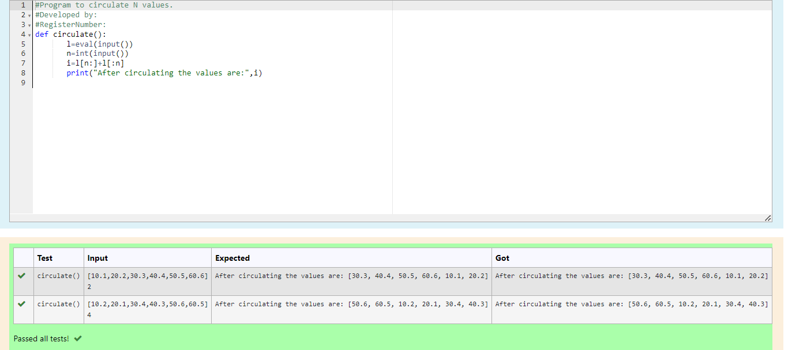

# Circulate-the-values-of-N-variables
## Aim:
To write a python program to circulate the n variables using function concept
## Equipment’s required:
PC
Anaconda - Python 3.7
## Algorithm: 
### Step 1:
Start the program

### Step 2:
Get the value from the user for the number of rotation

### Step 3:
Using the slicing concept rotate the list Get the value from the user for the number of rotation

### Step 4:
Using the slicing concept rotate the list Using the slicing concept rotate the list

### Step 5:
Using the concatination operation display the entire rotated list

### Step 6:
stop the program 
## Program:
### Program to circulate N values.
### Developed by: Jesu Smartia A
### RegisterNumber:212223110016
```
def circulate():
       l=eval(input())
       n=int(input())
       i=l[n:]+l[:n]
       print("After circulating the values are:",i)
```
## Output:

## Result:
Thus circulation of variables is done succesfully
